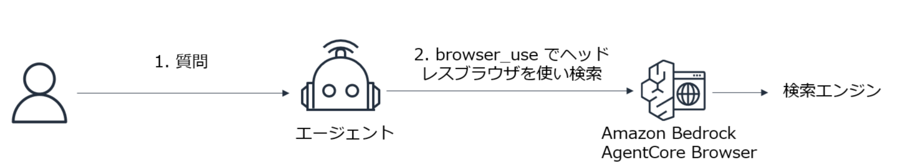

# AgentCore Browser に Browser-use で接続して、Yahoo の検索を使用する





---

---
### このサンプルは、BedrockAgentCoreBasic/prep/README.md の準備作業の完了後に動作可能です。
  - **Code Server 環境が構築され、当リポジトリが clone され、uv もインストールされている前提です。**
---

* 下記のコマンドでサンプルを実行できます。

```
cd BedrockAgentCoreBasic/browser_browser-use/
```

```
uv init
```

```
uv add strands-agents "strands-agents-tools[browser]" bedrock-agentcore playwright nest_asyncio

uv run playwright install chromium
```


```
uv run main.py
```

---
* 注意点
* Claude でクロスリージョン可能な基盤モデルを使用する
    - Claude 以外のモデルでは brouser-use を正常に扱えなかった
    - クロスリージョン以外のモデルではサポートされておらず実行に失敗する
* 参考ブログ
  - https://dev.classmethod.jp/articles/amazon-bedrock-agentcore-agentcore-browser-sample/
