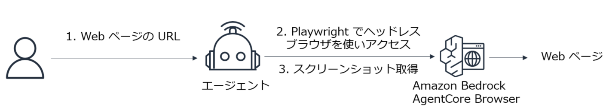

# AgentCore Browser に Playwright で接続して Web ページのスクリーンショットを取得する



---

```
uv init
uv add bedrock-agentcore playwright strands-agents
```

```
uv run main.py "Google のトップページのスクリーンショットを取得してください。"
```

---

* 参考ブログ
    - https://qiita.com/moritalous/items/c895e15dabb2ef41419c
