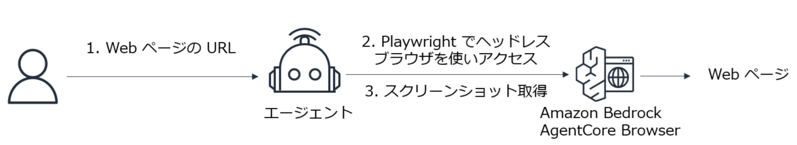

# AgentCore Browser に Playwright で接続して Web ページのスクリーンショットを取得する




---
### このサンプルは、BedrockAgentCoreBasic/prep/README.md の準備作業の完了後に動作可能です。
  - **Code Server 環境が構築され、当リポジトリが clone され、uv もインストールされている前提です。**
---

* 下記のコマンドでサンプルを実行できます。

```
cd  ~/environment/BedrockAgentCoreBasic/browser_playwright/
```

```
uv init
uv add bedrock-agentcore playwright strands-agents
```

```
uv run main.py "Google のトップページのスクリーンショットを取得してください。"
```

---

