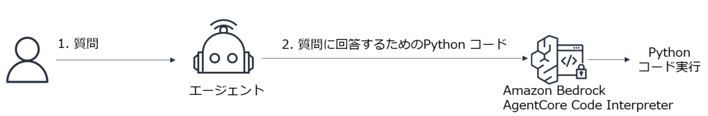

# Bedrock AgentCore Runtime にデプロイした Strands Agent の Tool から CodeInterpreter の機能を使用するサンプル



---
### このサンプルは、BedrockAgentCoreBasic/prep/README.md の準備作業の完了後に動作可能です。
  - **Code Server 環境が構築され、当リポジトリが clone され、uv もインストールされている前提です。**
    
---

* 下記のコマンドでサンプルを実行できます。

```
cd BedrockAgentCoreBasic/code_interpreter/with_agent
```

```
uv init
uv add strands-agents bedrock-agentcore
```

```
uv run main.py 
```

---
