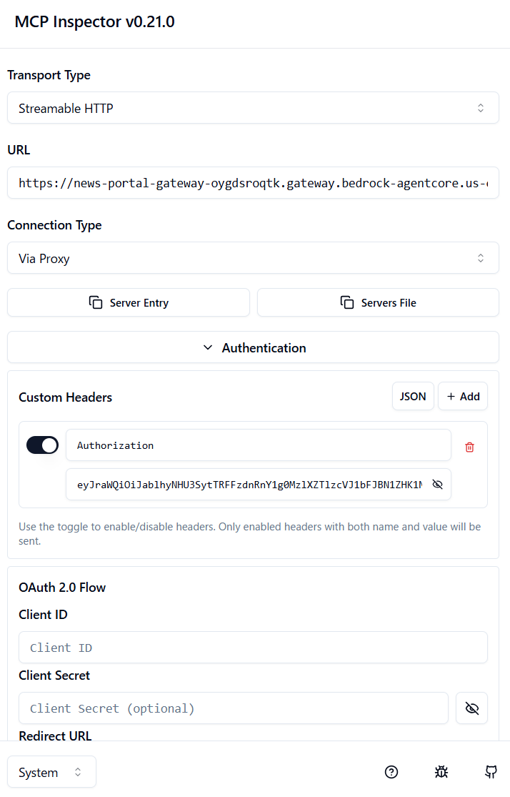

# AgentCore Gateway に MCP Inspector で接続する場合

* AgentCore Gateway は、リモート MCP サーバーとして使用できるので、MCP Inspector でも接続可能

1. AgentCore Gateway のアクセスに必要なトークンを取得
   - ```
     # AgentCore Gateway のトークン URL
     export TOKEN_URL="https://my-domain-f3t4ed31.auth.us-east-1.amazoncognito.com/oauth2/token"
     # AgentCore Gateway で使用する Cognito ユーザープール のクライアント ID
     export CLIENT_ID="xyza9abcdeff2abc10defg2a"
     # AgentCore Gateway で使用する Cognito ユーザープール のクライアントシークレット
     export CLIENT_SECRET="xxxx2rla6ixxxxxrvqffugp4d821a6xxxxxx6d6sl441txx46fk"
     ```
 
   - ```
     curl -X POST ${TOKEN_URL} \
      -H "Content-Type: application/x-www-form-urlencoded" \
      -d "grant_type=client_credentials&client_id=${CLIENT_ID}&client_secret=${CLIENT_SECRET}"
     ```

1. MCP Inspecror の起動

    - ```
      npx @modelcontextprotocol/inspector
      ```

1. 接続情報を入力して Connect ボタンをクリック

*　AgentCore Gateway のゲートウェイ URL をマネジメントコンソールからコピーする

* **ポイント**
    - Transport Type に Streamable HTTP を選択する
    - Authorization のヘッダのトグルを有効化する
    - GATEWAY_URL とトークンだけ入力する
      - その他の設定や入力は不要



