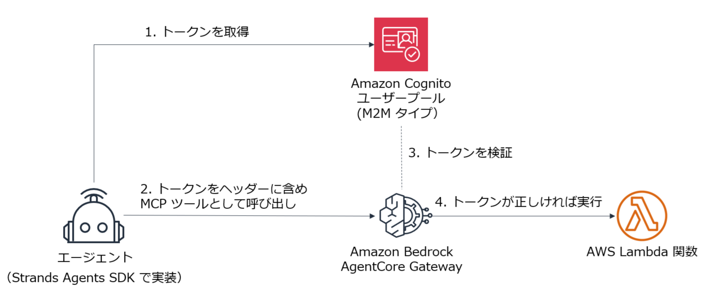

# AgentCore Gateway で Lambda 関数を MCP のツールとして使用する



### このサンプルは AgentCore Identity Inbound 認証のサンプルでもある

---
## 環境へのアクセス

* 下記の URL をコピーして、ブラウザの新しいタブで開きます。
    - `https://d-9567586b55.awsapps.com/start`
* 講師が URL とユーザー ID やパスワードをご案内します。

* ご自身に割り当てられた sandbox 環境で AWS マネジメントコンソールへアクセスします。

1. AWS マネジメントコンソールで、**オレゴン (us-west-2) リージョン**に切り替えます。

---
## ターゲットの Lambda 関数の作成

1. ページ上部の **検索** に `lambda` を入力して Enter キーを押下します。

1. AWS Lambda のページの左側のナビゲーションメニューで **関数** をクリックします。

1. **関数を作成** をクリックします。

1. **基本的な情報** で下記を入力・選択します。
   - **関数名**: `dummy-weather-99` (**99 はご自分の番号に置き換えます**）
   - **ランタイム**: **Python 3.14**

1. **関数を作成** をクリックします。

1. **Getting started** ダイアログが表示された場合は、**Dismiss** をクリックします。

1. **コード** タブのコードをすべて削除して、下記に置き換えます。
    - デモ用としてダミーの天気情報を返す実装にしています。
      
    ```
    import json
    
    def get_weather(location):
        return f"{location} は快晴です。"
    
    def lambda_handler(event, context):
        toolName = context.client_context.custom['bedrockAgentCoreToolName']
        delimiter = "___"
        if delimiter in toolName:
            toolName = toolName[toolName.index(delimiter) + len(delimiter):]
        print(toolName)
        if toolName == 'get_weather':
            return {'statusCode': 200, 'body': get_weather(event['location'])}
    ```
1. **Deploy** をクリックします。

1. ページ右上あたりに表示されている **関数 ARN** をコピーしてメモしておきます。
---
## AgentCore Gateway の作成

1. ページ上部の **検索** に `agentcore` を入力して Enter キーを押下します。
1. 左側のナビゲーションメニューで **ゲートウェイ** をクリックします。
1. **ゲートウェイを作成** をクリックします。
1. **ゲートウェイ名** に `my-gateway-99` を入力します。(**99 はご自分の番号に置き換えます**）
1. **追加設定　－ オプション**　をクリックします。
1. **セマンティック検索を有効にする** にチェックします。
1. **Permissions** の **IAM アクセス許可** で **別のロールを使用** を選択します。
1. 「既存のロールを選択」のリストから、`myAmazonBedrockAgentCoreGatewayDefaultServiceRole` を選択します。
1. **次へ** をクリックします。
   
1. **インバウンド ID を設定** で下記を設定します。
      - **JSON Web Tokens (JWT) を使用** を選択
      - **JWT スキーマ設定** で **Cognito を利用した設定のクイック作成** を選択
        - これにより Cognito の M2M タイプのユーザープールが自動的に作成されます。
1. **次へ** をクリックします。
1. **ターゲットを追加** で **ターゲット名** に `dummy-weather-99` を入力します。(**99 はご自分の番号に置き換えます**）
1. **ターゲットタイプ** で **Lambda ARN** を選択して、メモしておいた Lambda 関数の ARN を入力します。
1. **ターゲットスキーマ** で **インラインスキーマを定義** を選択して下記をインラインで入力します。
    - ```
      [
        {
            "description": "tool to get weather information for a specified location",
                "inputSchema": {
                "properties": {
                    "location": {
                    "description": "The location to get weather information for",
                    "type": "string"
                    }
                },
                "required": [
                    "location"
                ],
                "type": "object"
                },
                "name": "get_weather"
        }
      ]

1. **次へ** をクリックします。
1. **ゲートウェイを作成** をクリックします。
   
1. 青色のメッセージで、作成された Cognito ユーザープール の情報が表示されるので、すべてメモしておきます。
    - アプリケーションクライアント ID
    - クライアントシークレット
    - カスタムスコープ
        - マネコンのアプリケーションクライアントの [**ログインページ**] タブに表示されている
    - 検出 URL
        - マネコンで Gateway のページの [**インバウンド ID**] に表示されている
        - または Cognito のページの [**概要**] で [**トークン署名キー URL**] として表示されている URL の末尾を `/openid-configuration` に変更したもの


Cognito クライアント認証情報 ゲートウェイ用に次の Cognito リソースが作成されました。 
1.Cognito ユーザープール (ID:us-west-2_P9q5MzRzE) 
2.ユーザープールドメイン:my-domain-cmr792mf.auth.us-west-2.amazoncognito.com 
3.次のスコープを持つリソースサーバー: genesis-gateway:invoke 
4.クライアント認証情報フローを使用するユーザープールクライアント 
**クライアント ID: ** 74eckne7c6h55s3lkqn4sko0r9 
クライアントシークレット: gjab9ko9qofefg9pptp20udqpternbg38l8egin908efksj0q2g 重要: 
これらの認証情報を保存してください。クライアントシークレットは一度だけ表示されます。

1. **ゲートウェイの詳細** に表示されている **ゲートウェイリソース URL** をメモしておきます。

https://my-gateway-11-jmubowswd1.gateway.bedrock-agentcore.us-west-2.amazonaws.com/mcp

1. ページを下にスクロールして、**インバウンド認証** に表示されている **検出 URL** をメモしておきます。

https://cognito-idp.us-west-2.amazonaws.com/us-west-2_P9q5MzRzE/.well-known/openid-configuration 

---
## Strands Agents SDK を使用して Tool として呼び出す

* Code Server 環境を開きます。
* BedrockAgentCoreBasic/gateway に `.env` ファイルを作成します。
    - **CUSTOM_SCOPE の 99 の部分はご自分の番号に置き換えてください。**
    - ```
      CLIENT_ID=(クライアント ID)
      CLIENT_SECRET=(クライアントシークレット)
      DISCOVERY_URL=(検出 URL)
      CUSTOM_SCOPE=my-gateway-99/(次のスコープを持つリソースサーバー)
      GATEWAY_URL=(ゲートウェイリソース URL)
      ```

    - 下記は例です。
    - ```
      CLIENT_ID=10dc4pd40kct1bsgfcthtssqec
      CLIENT_SECRET=umko5pafgnovmqqdemdt8rr7kv1qaknrgjaiqhj4nrktc2rjjag
      DISCOVERY_URL=https://cognito-idp.us-west-2.amazonaws.com/us-west-2_J1m1pFhGG/.well-known/openid-configuration
      CUSTOM_SCOPE=my-gateway-11/genesis-gateway:invoke
      GATEWAY_URL=https://my-gateway-11-hkval6viaw.gateway.bedrock-agentcore.us-west-2.amazonaws.com/mcp
      ```

* 次のコマンドで main.py を実行し、Gateway のツールを使用します。
    - ```
      # プロジェクト初期化
      uv init
      ```
    
    - ```
      # 依存パッケージを追加
      #   - mcp は本家 SDK を明示指定（1.x 系）
      uv add strands-agents "mcp>=1.0,<2" python-dotenv requests
      ```
    
    - ```
      # 実行
      uv run main.py
      ```

    - **main.py**
    - モデルはデフォルトの Claude Sonnet 4 を使用。
    - (Nova Lite でも試してみたが、うまく動作しなかった。)

---
## (参考) AgentCore Gateway のコンソールに表示されているサンプルコード

1. マネージメントコンソールで作成した AgentCore Gateway のページの **View invocation code** にも Gateway を使用してツールのリストを取得するコードの例が表示されている。
    - この例には、アプリクライアントやシークレット以外で、環境に応じた値（Gateway や Cognito の URL の値）が設定されているが、環境変数から取得するように変更した。
    - TOKEN_URLは、マネジメントコンソールに表示されているコード例の中から参照できる
    - .env の内容
    - ```
      CLIENT_ID=xxxxxxxxxxxxxxxxxxxxxxx
      CLIENT_SECRET=xxxxxxxxxxxxxxxxxxxxxxxxxxxxxxx
      TOKEN_URL=https://my-domain-xxxxxxxx.auth.us-west-2.amazoncognito.com/oauth2/token
      GATEWAY_URL=https://xxxxxxxxxxxxxxxxxxxx.gateway.bedrock-agentcore.us-west-2.amazonaws.com/mcp
      ```


    - ```
      pip3 install strands-agents mcp dotenv requests asyncio
      ```
      
- **mcp_python_sdk.py**
  - mcp パッケージを使用してツールのリストを取得する
- **python_with_requests.py**
  - requests パッケージを使用してツールのリストを取得する
- **strands_mcp_client.py**
  - Strands Agent が MCP Client としてツールのリストを取得する

---
* 参考情報
  - https://tech.nri-net.com/entry/implement_gateway_and_try_it_out
