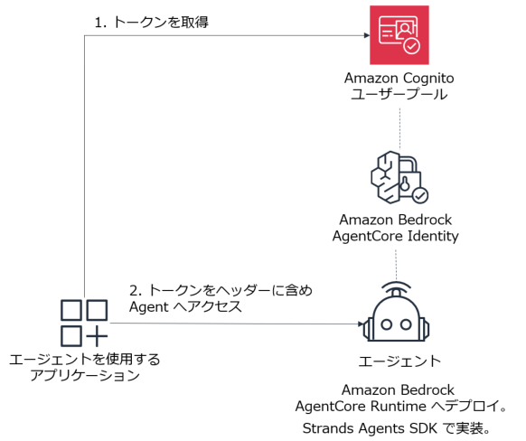

# AgentCore Identity (Inbound Auth)

---
## AgentCore Identity のユースケース

1. Inbound Auth
    - AgentCore Runtime で動作する Agent の呼び出しに Bearer トークンが必要という構成にする
2. Outbound Auth
    1. AgentCore Identity を使用し Agent が外部サービスを呼び出すときと API キーを取得する
    2. AgentCore Identity を使用し Agent が AgentCore Gateway で外部サービスを呼び出すときとの Bearer トークンを取得する

---
## Inbound Auth



  * Cognito ユーザープールの作成と環境変数の設定
    - ```
      ./setup_cognito.sh
      source cognito.env
      ```

  * Agent を Cognito のトークンによる認証が必要な構成で AgentCore Runtime にデプロイ
    - ```
      agentcore configure --entrypoint agent_example.py \
        --name my_inbound_auth_agent \
        --execution-role arn:aws:iam::068048081706:role/my-AgentCore-runtime-role \
        --disable-otel \
        --requirements-file requirements.txt \
        --authorizer-config "{\"customJWTAuthorizer\":{\"discoveryUrl\":\"$DISCOVERY_URL\",\"allowedClients\":[\"$CLIENT_ID\"]}}"
      ```
    - リクエストヘッダーのallowListの構成は不要。メモリの設定も不要

    - ```
      agentcore launch
      ```

    - マネジメントコンソールでは、作成されたエージェントのインバウンド認証の設定は、「バージョン1」のリンクをクリックすることで確認できる

    - agentcore launch 実行により出力される Agent ARN の値を環境変数に設定しておく
        - Agent ARNに含まれる:（コロン）は%3Aに、 /（スラッシュ）は%2Fにエンコードする必要あり
    - 下記は例
    - arn:aws:bedrock-agentcore:us-east-1:068048081706:runtime/id_agent-uCz8otAJ0b の場合
    - ```
      export ESCAPED_AGENT_ARN=arn%3Aaws%3Abedrock-agentcore%3Aus-east-1%3A068048081706%3Aruntime%2Fid_agent-uCz8otAJ0b
      ```

*  Cognito で認証してトークンを取得

  - ```
    export TOKEN=$(aws cognito-idp initiate-auth \
      --client-id "$CLIENT_ID" \
      --auth-flow USER_PASSWORD_AUTH \
      --auth-parameters USERNAME='testuser',PASSWORD='PERMANENT_PASSWORD' \
      --region us-east-1 | jq -r '.AuthenticationResult.AccessToken')
    ```

*  Token を使用して呼び出し


  - ```
    export PAYLOAD='{"prompt": "こんにちは、 1+1の答えは?"}'
    export BEDROCK_AGENT_CORE_ENDPOINT_URL="https://bedrock-agentcore.us-east-1.amazonaws.com"

    curl -v -X POST "${BEDROCK_AGENT_CORE_ENDPOINT_URL}/runtimes/${ESCAPED_AGENT_ARN}/invocations?qualifier=DEFAULT" \
    -H "Authorization: Bearer ${TOKEN}" \
    -H "Content-Type: application/json" \
    -d "${PAYLOAD}"
    ```

* 無効な Token の場合、エラーになることを確認

    - ```
    export TOKEN=xxx

    curl -v -X POST "${BEDROCK_AGENT_CORE_ENDPOINT_URL}/runtimes/${ESCAPED_AGENT_ARN}/invocations?qualifier=DEFAULT" \
    -H "Authorization: Bearer ${TOKEN}" \
    -H "Content-Type: application/json" \
    -d "${PAYLOAD}"
    ```

---
* 参考ドキュメント
  - https://docs.aws.amazon.com/ja_jp/bedrock-agentcore/latest/devguide/runtime-oauth.html
