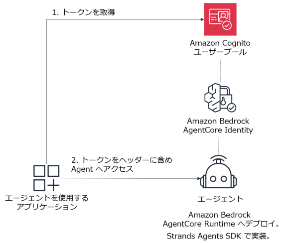
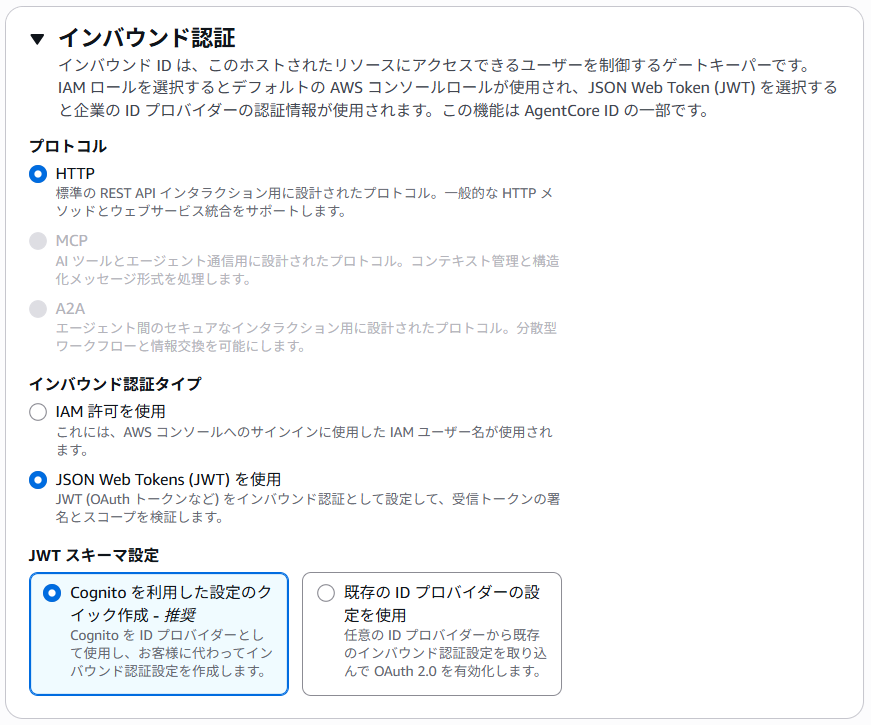
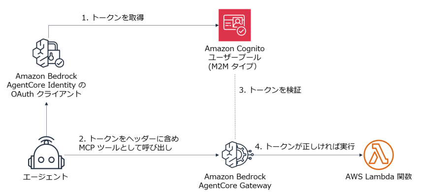

# AgentCore Identity (Inbound Auth)

* 参考ドキュメント
  - https://docs.aws.amazon.com/ja_jp/bedrock-agentcore/latest/devguide/runtime-oauth.html

---
## AgentCore Identity のユースケース

1. Inbound Auth
    1. AgentCore Runtime で動作する Agent の呼び出しに Bearer トークンが必要という構成にする
    2. AgentCore Gateway と統合したツールの呼び出し時に Bearer トークンが必要という構成にする

2. Outbound Auth
    - AgentCore Identity を使用し Agent が外部サービスを呼び出すときと API キーを取得する

---
## 1. AgentCore Runtime で動作する Agent の呼び出しに Bearer トークンが必要という構成にする



### 構成方法の例

* [agentcore CLI で Inbound 認証を構成したエージェントをデプロイする例](#cli)
* [AWS マネジメントコンソール で Inbound 認証を構成したエージェントをデプロイする例](#console)
  
---
<a id="cli"></a>
### agentcore CLI で Inbound 認証を構成したエージェントをデプロイする例

  * Cognito ユーザープールの作成と環境変数の設定
    - ```
      ./setup_cognito.sh
      source cognito.env
      ```
    - (参考）ユーザープールのクライアントでクライアントシークレットも作成する場合は、setup_cognito_with_secret.sh を参考にする

  * Agent を Cognito のトークンによる認証が必要な構成で AgentCore Runtime にデプロイ
    - ```
      agentcore configure --entrypoint agent_example.py \
        --name my_inbound_auth_agent \
        --execution-role arn:aws:iam::068048081706:role/my-AgentCore-runtime-role \
        --disable-otel \
        --requirements-file requirements.txt \
        --authorizer-config "{\"customJWTAuthorizer\":{\"discoveryUrl\":\"$DISCOVERY_URL\",\"allowedClients\":[\"$CLIENT_ID\"]}}"
      ```
    - リクエストヘッダーのallowListの構成は不要。メモリの設定も不要

    - ```
      agentcore launch
      ```

    - マネジメントコンソールでは、作成されたエージェントのインバウンド認証の設定は、「バージョン1」のリンクをクリックすることで確認できる

    - agentcore launch 実行により出力される Agent ARN の値を環境変数に設定しておく
        - Agent ARNに含まれる:（コロン）は%3Aに、 /（スラッシュ）は%2Fにエンコードする必要あり
    - 下記は例
    - arn:aws:bedrock-agentcore:us-east-1:068048081706:runtime/my_inbound_auth_agent-4CpCfb8Ukn の場合
    - ```
      export ESCAPED_AGENT_ARN=arn%3Aaws%3Abedrock-agentcore%3Aus-east-1%3A068048081706%3Aruntime%2Fmy_inbound_auth_agent-4CpCfb8Ukn 
      ```

*  Cognito で認証してトークンを取得

  - ```
    export TOKEN=$(aws cognito-idp initiate-auth \
      --client-id "$CLIENT_ID" \
      --auth-flow USER_PASSWORD_AUTH \
      --auth-parameters USERNAME='testuser',PASSWORD='PERMANENT_PASSWORD' \
      --region us-east-1 | jq -r '.AuthenticationResult.AccessToken')
    ```

*  Token を使用して呼び出し

  - ```
    export PAYLOAD='{"prompt": "こんにちは、 1+1の答えは?"}'
    export BEDROCK_AGENT_CORE_ENDPOINT_URL="https://bedrock-agentcore.us-east-1.amazonaws.com"

    curl -v -X POST "${BEDROCK_AGENT_CORE_ENDPOINT_URL}/runtimes/${ESCAPED_AGENT_ARN}/invocations?qualifier=DEFAULT" \
    -H "Authorization: Bearer ${TOKEN}" \
    -H "Content-Type: application/json" \
    -d "${PAYLOAD}"
    ```

* 無効な Token の場合、エラーになることを確認

  - ```
    export TOKEN=xxx

    curl -v -X POST "${BEDROCK_AGENT_CORE_ENDPOINT_URL}/runtimes/${ESCAPED_AGENT_ARN}/invocations?qualifier=DEFAULT" \
    -H "Authorization: Bearer ${TOKEN}" \
    -H "Content-Type: application/json" \
    -d "${PAYLOAD}"
    ```
---
* 環境のクリア
  - AgentCore のコンソールの「エージェントランタイム」からランタイムリソース: my_inbound_auth_agent を削除
  - Cognito のコンソールで「ユーザーエージェント」の MyUserPool を削除


---


<a id="console"></a>
### AWS マネジメントコンソール で Inbound 認証を構成したエージェントをデプロイする例

* ナビゲーションメニュー 「ラインタイムエージェント」からエージェントをデプロイする際に、「インバウンド認証」セクションで構成してエージェントをデプロイ



* デプロイしたエージェントの「ランタイム ARN」の値を環境変数に設定しておく
    - ARN に含まれる:（コロン）は%3Aに、 /（スラッシュ）は%2Fにエンコードする必要あり
    - 下記は例
    - arn:aws:bedrock-agentcore:us-east-1:068048081706:runtime/my_inbound_auth_agent-4CpCfb8Ukn  の場合
    - ```
      export ESCAPED_AGENT_ARN=arn%3Aaws%3Abedrock-agentcore%3Aus-east-1%3A068048081706%3Aruntime%2Fmy_inbound_auth_agent-4CpCfb8Ukn 
      ```

* またデプロイ後、Cognito ユーザープールとのクライアントが作成されているので、環境変数で POOL_ID にユーザープール ID を、CLIENT_ID に アプリケーションクライアント ID を設定する

```
POOL_ID=us-east-1_IIvfidhXZ
CLIENT_ID=4k8bv0dda0aou82q0mhh2fec5
```

* Congnito ユーザープールにユーザーを作成する

```
aws cognito-idp admin-create-user \
  --user-pool-id $POOL_ID \
  --username "testuser" \
  --temporary-password "Test@1234" \
  --region us-east-1 \
  --message-action SUPPRESS > /dev/null
```

```
aws cognito-idp admin-set-user-password \
  --user-pool-id $POOL_ID \
  --username "testuser" \
  --password "Demo@1234" \
  --region us-east-1 \
  --permanent > /dev/null
```

*  Cognito で認証してトークンを取得

```
export TOKEN=$(aws cognito-idp initiate-auth \
      --client-id "$CLIENT_ID" \
      --auth-flow USER_PASSWORD_AUTH \
      --auth-parameters USERNAME='testuser',PASSWORD='PERMANENT_PASSWORD' \
      --region us-east-1 | jq -r '.AuthenticationResult.AccessToken')
```

*  Token を使用して呼び出し

```
export PAYLOAD='{"prompt": "こんにちは、 1+1の答えは?"}'
export BEDROCK_AGENT_CORE_ENDPOINT_URL="https://bedrock-agentcore.us-east-1.amazonaws.com"

curl -v -X POST "${BEDROCK_AGENT_CORE_ENDPOINT_URL}/runtimes/${ESCAPED_AGENT_ARN}/invocations?qualifier=DEFAULT" \
    -H "Authorization: Bearer ${TOKEN}" \
    -H "Content-Type: application/json" \
    -d "${PAYLOAD}"
```

* 無効な Token の場合、エラーになることを確認

```
export TOKEN=xxx

curl -v -X POST "${BEDROCK_AGENT_CORE_ENDPOINT_URL}/runtimes/${ESCAPED_AGENT_ARN}/invocations?qualifier=DEFAULT" \
    -H "Authorization: Bearer ${TOKEN}" \
    -H "Content-Type: application/json" \
    -d "${PAYLOAD}"
```

---

## 2. AgentCore Gateway と統合したツールの呼び出し時に Bearer トークンが必要という構成にする



* **main-local.py**
* サンプルコードでは Agent ではなく通常の Python コードから Bearer トークンを取得し、AgentCore Gateway で weather を呼び出す。
    - このリポジトリの gateway フォルダのサンプルで作成した weather を呼び出す前提
    - gateway サンプルでは Cognito から Bearer トークンを取得したが、このサンプルでは AgentCore Identity の機能を使用して Bearer トークン を取得する

#### 準備

1. このリポジトリの AgentCore Gateway のサンプルを構成しておく

1. AWS マネジメントコンソールで AgentCore Identity のアウトバウンド認証の OAuth クライアントを作成
    - 「プロバイダー」で「カスタムプロバイダ」を選択
    - 「プロバイダーの設定」で、「設定タイプ」に「検出 URL」を選択
        - 「クライアント ID」に、AgentCore Gateway の Cognito ユーザープールのクライアント ID を入力
        - 「クライアント シークレットに、AgentCore Gateway の Cognito ユーザープールのクライアントシークレットを入力
        - 「検出 URL」に、AgentCore Gateway の検出 URL を入力
    - 作成した OAuth クライアントの名前をメモしておく

#### 実行

1. .env を作成
   - PROVIDER_NAME は、作成した AgentCore Identity のアウトバウンド認証の OAuth クライアントの名前
   - CUSTOM_SCOPE は、マネコンで Cognito のアプリケーションクライアントの [ログインページ] タブに表示されている
   - GATEWAY_URL は、AgentCore Gateway のページに表示されている
   - 例
    ```
    PROVIDER_NAME=resource-provider-oauth-client-pasa8
    CUSTOM_SCOPE=get-weather-gw/genesis-gateway:invoke
    GATEWAY_URL=https://get-weather-gw-8risf7vrf6.gateway.bedrock-agentcore.us-east-1.amazonaws.com/mcp
    ```

1. サンプル実行
    ```
    pip3 install strands-agents mcp dotenv requests asyncio
    ```

    ```
    python3 main-local.py
    ```

---

#### その他のサンプル
* **main.py**
    - Outbound 認証で Gateway にアクセスするエージェントを Runtime にデプロイする場合の実装
    - agentcore コマンドでデプロイできる  