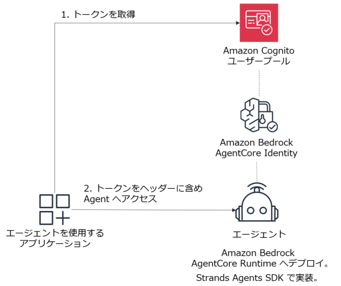
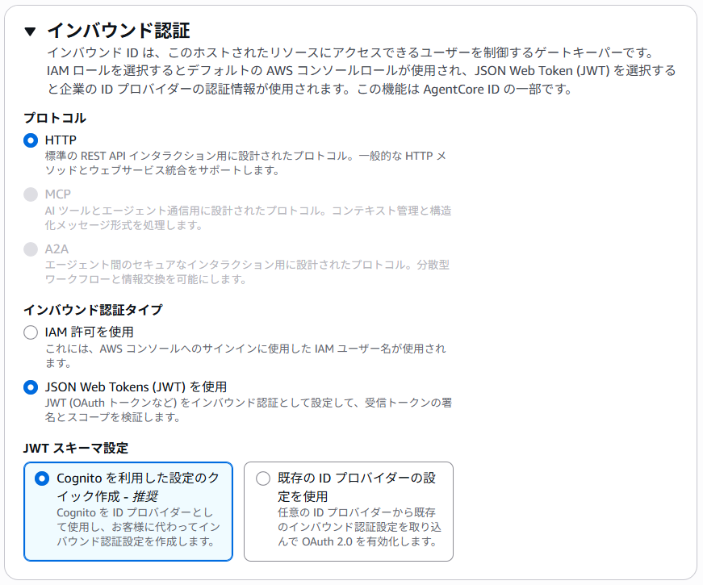
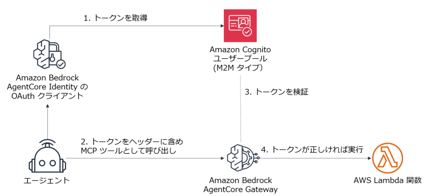

# AgentCore Identity (Inbound Auth)

* 参考ドキュメント
  - https://docs.aws.amazon.com/ja_jp/bedrock-agentcore/latest/devguide/runtime-oauth.html

---
## AgentCore Identity のユースケース

1. Inbound Auth
    1. AgentCore Runtime で動作する Agent の呼び出しに Bearer トークンが必要という構成にする
    2. AgentCore Gateway と統合したツールの呼び出し時に Bearer トークンが必要という構成にする

2. Outbound Auth
    1. AgentCore Identity を使用し Agent が外部サービスを呼び出すときに API キーを取得する
    2. AgentCore Identity を使用し Agent が外部サービスを呼び出すときに JWT トークンを取得する

---
### このワークは、BedrockAgentCoreBasic/prep/README.md の準備作業が完了し、AgentCore Runtime のワーク完了後に実施する想定です。
  - よって、 **Code Server 環境が構築され、当リポジトリが clone され、uv もインストールされ、agentcore CLI もインストールされている前提です。**

---
## 1. AgentCore Runtime で動作する Agent の呼び出しに Bearer トークンが必要という構成にする



### ワークのタスク

* [タスク 1: agentcore CLI で Inbound 認証を構成したエージェントをデプロイする](#cli)
* [タスク 2: AWS マネジメントコンソール で Inbound 認証を構成したエージェントをデプロイする](#console)


---
<a id="cli"></a>
### タスク 1: agentcore CLI で Inbound 認証を構成したエージェントをデプロイする例

---
#### 環境へのアクセス

* 下記の URL をコピーして、ブラウザの新しいタブで開きます。
    - `https://d-9567586b55.awsapps.com/start`
* 講師が URL とユーザー ID やパスワードをご案内します。

* ご自身に割り当てられた sandbox 環境で AWS マネジメントコンソールへアクセスします。

1. AWS マネジメントコンソールで、**オレゴン (us-west-2) リージョン**に切り替えます。

---
#### 手順

* Code Server 環境を開き、ターミナルで下記のコマンドを実行します。

* Cognito ユーザープールの作成と環境変数の設定を実行します。
    - ```
      cd  ~/environment/BedrockAgentCoreBasic/identity_inbound_auth
      ```

* Cognito ユーザープールの作成と環境変数の設定を実行します。

    - ```
      chmod +x ./setup_cognito.sh
      ```

    - ```
      ./setup_cognito.sh
      ```
    - ```
      source cognito.env
      ```
    - 下記を実行し、DISCOVERY_URL と CLIENT_ID の値をメモしておきます。
    - ```
      echo DISCOVERY_URL = $DISCOVERY_URL
      echo CLIENT_ID = $CLIENT_ID
      ```

    - (参考）ユーザープールのクライアントでクライアントシークレットも作成する場合は、setup_cognito_with_secret.sh を参考にしてください。

* Agent を Cognito のトークンによる認証が必要な構成で AgentCore Runtime にデプロイします。
    - エージェントのコードはリポジトリに用意されている `main.py` です。

    ```
    agentcore create
    ```

* 対話モードで下記を選択
    - Project name: `AuthAgent` を **入力**
    - What would you like to build?: `Agent` を選択 
    - Agent name: `MyAgent` (デフォルト) を選択
    - Select agent type: `Create new agent` を選択
    - Language: `Python` を選択
    - Build: `Direct Code Deploy` を選択
    - Protocol: `HTTP` を選択
    - Framework: `Strands Agents SDK` を選択
    - Model: `Amazon Bedrock (us.anthropic.claude-sonnet-4-5-20250514-v1:0)` を選択
    - Memory: `None` を選択
    - Customiza advanced settings: **Custom auth (JWT)** を選択
    - Add Agent: **`Custom JWT`** を選択
    - **Discovery URL**: メモしておいた DISCOVERY_URL の値を入力
    - **Allowed Clients**: を選択
    - **Allowed Clients**: メモしておいた CLIENT_ID の値を入力
    - OAuth Client ID: 何も入力せず、Enter
    - 最後にもう一度 Enter

* プロジェクト作成が完了するまで少し待ち、完了後に下記でプロジェクトフォルダに移動します。
  
    ```
    cd AuthAgent
    ```

---
#### main.py の編集

* AgentCore プロジェクトで作成された main.py に上書きコピーします。

    ```
    cp  ~/environment/BedrockAgentCoreBasic/identity_inbound_auth/main.py    ~/environment/BedrockAgentCoreBasic/identity_inbound_auth/AuthAgent/app/MyAgent/main.py
    ```
---
#### エージェントのデプロイ

* エージェントをデプロイします。
    - ```
      agentcore deploy -y
      ```

    - マネジメントコンソールでは、作成されたエージェントのインバウンド認証の設定は、「バージョン1」のリンクをクリックすることで確認できます。

---
#### AgentCore ラインタイムの ARN の取得

* デプロイしたエージェントを呼び出すためには、エージェントの Amazon Resource Name (ARN) が必要になるため、次のコマンドで取得します。

    - ```
      agentcore status
      ```

* 下記のような出力の中で ARN の値をメモしておきます。
    - 下記の例だと、**arn:aws:bedrock-agentcore:us-west-2:123456789012:runtime/handson_MyAgent-suHGqe9XiS**　が ARN の値になります。
    - ```
      Agents
        MyAgent: Deployed - Runtime: READY (arn:aws:bedrock-agentcore:us-west-2:123456789012:runtime/handson_MyAgent-suHGqe9XiS)
        URL: https://bedrock-agentcore.us-west-2.amazonaws.com/runtimes/arn%3Aaws%3Abedrock-agentcore%3Aus-west-2%3A123456789012%3Aruntime%2Fhandson_MyAgent-suHGqe9XiS/invocations
      ```

* ARN を環境変数に設定します。

    - ```
      export ARN=(メモした ARN の値)
      ```

---
#### 確認

*  Cognito で認証してトークンを取得

    - ```
      export TOKEN=$(aws cognito-idp initiate-auth \
        --client-id "$CLIENT_ID" \
        --auth-flow USER_PASSWORD_AUTH \
        --auth-parameters USERNAME='testuser',PASSWORD='PERMANENT_PASSWORD' \
        --region us-east-1 | jq -r '.AuthenticationResult.AccessToken')
      ```
    - ```
      echo $TOKEN
      ```
    
*  Token を使用して呼び出し

    - ```
      cd  ~/environment/BedrockAgentCoreBasic/identity_inbound_auth/
      ```

    - ```
      uv init
      uv add requests python-dotenv
      ```

    - ```
      uv run python invoke.py "こんにちは"
      ```
    - 下記例のような出力を確認して、エージェントを呼び出せたことを確認します
    - ```
      === エージェントからの応答 ===
      "こんにちは！👋 お元気ですか？何かお手伝いできることはありますか？😊\n"
      ```

* 無効な Token の場合、エラーになることを確認します。

    - ```
      export TOKEN=xxx
      ```
    - ```
      uv run python invoke.py "こんにちは"
      ```
    - `requests.exceptions.HTTPError: 403 Client Error: Forbidden for url:`

#### お疲れさまでした。JWT トークンが必要なエージェントを作成し、呼び出すことができました。

---

#### （以降はオプションです）curl コマンドでの確認

* ARN 環境変数 に含まれる:（コロン）は%3Aに、 /（スラッシュ）は%2Fにエンコードします。
  - これは curl コマンドの URL のパスに含む必要があるためです。
  - ```
    export ESCAPED_AGENT_ARN=$(echo "$ARN" | sed 's/:/%3A/g; s/\//%2F/g')
    ```

*  Cognito で認証してトークンを取得

  - ```
    export TOKEN=$(aws cognito-idp initiate-auth \
      --client-id "$CLIENT_ID" \
      --auth-flow USER_PASSWORD_AUTH \
      --auth-parameters USERNAME='testuser',PASSWORD='PERMANENT_PASSWORD' \
      --region us-east-1 | jq -r '.AuthenticationResult.AccessToken')
    ```
  - ```
    echo $TOKEN
    ```
    
*  Token を使用して呼び出します。 (curl 使用）
  

  - curl コマンドで呼び出します。
  - ```
    export PAYLOAD='{"prompt": "こんにちは、 1+1の答えは?"}'
    export BEDROCK_AGENT_CORE_ENDPOINT_URL="https://bedrock-agentcore.us-west-2.amazonaws.com"

    curl -v -X POST "${BEDROCK_AGENT_CORE_ENDPOINT_URL}/runtimes/${ESCAPED_AGENT_ARN}/invocations?qualifier=DEFAULT" \
    -H "Authorization: Bearer ${TOKEN}" \
    -H "Content-Type: application/json" \
    -d "${PAYLOAD}"
    ```

* 無効な Token の場合、エラーになることを確認します。

  - ```
    export TOKEN=xxx

    curl -v -X POST "${BEDROCK_AGENT_CORE_ENDPOINT_URL}/runtimes/${ESCAPED_AGENT_ARN}/invocations?qualifier=DEFAULT" \
    -H "Authorization: Bearer ${TOKEN}" \
    -H "Content-Type: application/json" \
    -d "${PAYLOAD}"
    ```
---
* （オプション）環境のクリア
  - AgentCore のコンソールの「エージェントランタイム」からランタイムリソース: my_inbound_auth_agent を削除
  - Cognito のコンソールで「ユーザーエージェント」の MyUserPool を削除


---


<a id="console"></a>
### AWS マネジメントコンソール で Inbound 認証を構成したエージェントをデプロイする例

* ナビゲーションメニュー 「ラインタイムエージェント」からエージェントをデプロイする際に、「インバウンド認証」セクションで構成してエージェントをデプロイします。
    - 名前に「agent-pool-」という接頭辞がついた Cognito ユーザープールとそのアプリケーションクライアントが自動で作成されます。
    - このアプリケーションクライアントは、デフォルトでは **M2M タイプではありません。** よってクライアントシークレットもありません。



* デプロイしたエージェントの「ランタイム ARN」の値を環境変数に設定します。
  - ARN に含まれる:（コロン）は%3Aに、 /（スラッシュ）は%2Fにエンコードします。これは curl で指定する URL 内に含める必要があるためです。
  - ```
    export ESCAPED_AGENT_ARN=$(echo "$ARN" | sed 's/:/%3A/g; s/\//%2F/g')
    ```

* またデプロイ後、Cognito ユーザープールとのクライアントが作成されているので、環境変数で POOL_ID にユーザープール ID を、CLIENT_ID に アプリケーションクライアント ID を設定します。

```
POOL_ID=us-east-1_IIvfidhXZ
CLIENT_ID=4k8bv0dda0aou82q0mhh2fec5
```

* Congnito ユーザープールにユーザーを作成します。

```
aws cognito-idp admin-create-user \
  --user-pool-id $POOL_ID \
  --username "testuser" \
  --temporary-password "Test@1234" \
  --region us-east-1 \
  --message-action SUPPRESS > /dev/null
```

```
aws cognito-idp admin-set-user-password \
  --user-pool-id $POOL_ID \
  --username "testuser" \
  --password "Demo@1234" \
  --region us-east-1 \
  --permanent > /dev/null
```

*  Cognito で認証してトークンを取得します。

```
export TOKEN=$(aws cognito-idp initiate-auth \
      --client-id "$CLIENT_ID" \
      --auth-flow USER_PASSWORD_AUTH \
      --auth-parameters USERNAME='testuser',PASSWORD='PERMANENT_PASSWORD' \
      --region us-east-1 | jq -r '.AuthenticationResult.AccessToken')
```

*  Token を使用して呼び出します。

```
export PAYLOAD='{"prompt": "こんにちは、 1+1の答えは?"}'
export BEDROCK_AGENT_CORE_ENDPOINT_URL="https://bedrock-agentcore.us-east-1.amazonaws.com"

curl -v -X POST "${BEDROCK_AGENT_CORE_ENDPOINT_URL}/runtimes/${ESCAPED_AGENT_ARN}/invocations?qualifier=DEFAULT" \
    -H "Authorization: Bearer ${TOKEN}" \
    -H "Content-Type: application/json" \
    -d "${PAYLOAD}"
```

* 無効な Token の場合、エラーになることを確認します。

```
export TOKEN=xxx

curl -v -X POST "${BEDROCK_AGENT_CORE_ENDPOINT_URL}/runtimes/${ESCAPED_AGENT_ARN}/invocations?qualifier=DEFAULT" \
    -H "Authorization: Bearer ${TOKEN}" \
    -H "Content-Type: application/json" \
    -d "${PAYLOAD}"
```

---

## 2. AgentCore Gateway と統合したツールの呼び出し時に Bearer トークンが必要という構成にする

### AgentCore Gateway 作成時に インバウンド認証を指定することで、この構成にできる。



#### マネジメントコンソールで Cognito ユーザープールの同時作成または既存ユーザープールの選択も可能

* 同時に作成するオプションを選択した場合、名前に「my-user-pool-」という接頭辞がついた Cognito ユーザープールとそのアプリケーションクライアントが自動作成される。
    - このアプリケーションクライアントは、**M2M タイプ** であり、クライアントシークレットが設定されている

* 手順は、[AgentCore Gateway で Lambda 関数を MCP のツールとして使用する](https://github.com/tetsuo-nobe/BedrockAgentCoreBasic/tree/main/gateway) に掲載

