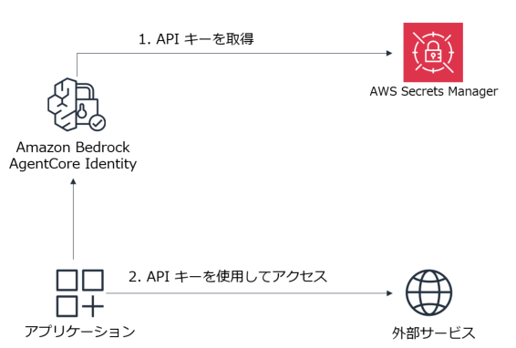
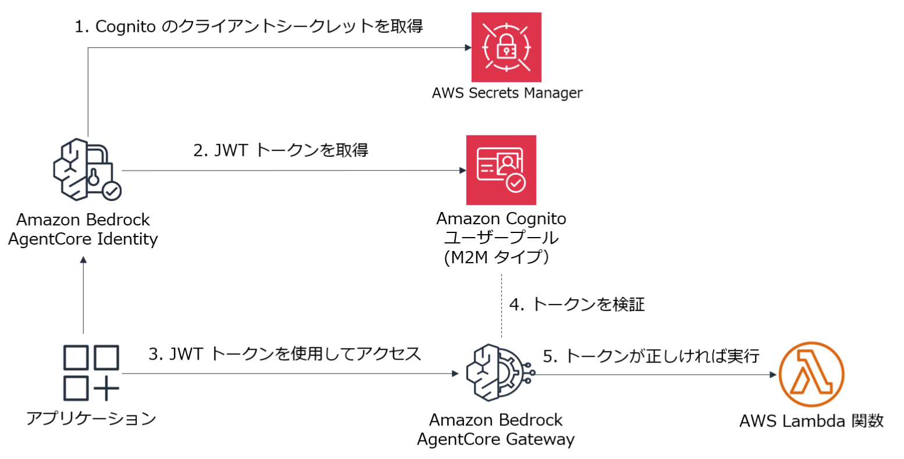

# AgentCore Identity (Outbound Auth)

## AgentCore Identity のユースケース

1. Inbound Auth
    1. AgentCore Runtime で動作する Agent の呼び出しに Bearer トークンが必要という構成にする
    2. AgentCore Gateway と統合したツールの呼び出し時に Bearer トークンが必要という構成にする

2. Outbound Auth
    1. AgentCore Identity を使用し Agent が外部サービスを呼び出すときと API キーを取得する
    2. AgentCore Identity を使用し Agent が外部サービスを呼び出すときと JWT トークンを取得する

---
## Outbound Auth


### 1. AgentCore Identity を使用し Agent が外部サービスを呼び出すときと API キーを取得する



#### サンプル 1
* **main-apiKey-OpenWeather.py**
* このサンプルコードでは Agent ではなく通常の Python コードから OpenWeather の API キーを取得し、シアトルの天候情報を取得する

##### 準備

1. OpenWeather の API キーを入手しておく (無料)
    - https://openweathermap.org/

1. AWS マネジメントコンソールで AgentCore Identity の API キーを作成

1. Anthropic の SDK のインストール

    ```
    pip3 install requests asyncio
    ```

##### 実行

1. サンプル実行

    ```
    python3 main-apiKey-OpenWeatgher.py
    ```

#### サンプル 2 
* **main-apiKey.py**
* このサンプルコードでは Agent ではなく通常の Python コードから API キーを取得し、Anthropic SDK を使用して Claude を呼び出す

##### 準備

1. Anthropic の API キーを入手しておく (有料)

1. AWS マネジメントコンソールで AgentCore Identity の API キーを作成

1. Anthropic の SDK のインストール

    ```
    pip3 install anthropic asyncio
    ```

##### 実行

1. サンプル実行

    ```
    python3 main-apiKey.py
    ```

---

### 2. AgentCore Identity を使用し Agent が外部サービスを呼び出すときと JWT トークンを取得する



* **main-local.py**
* サンプルコードでは Agent ではなく通常の Python コードから Bearer トークンを取得し、AgentCore Gateway で weather を呼び出す。
    - このリポジトリの gateway フォルダのサンプルで作成した weather を呼び出す前提
    - gateway サンプルでは Cognito から Bearer トークンを取得したが、このサンプルでは AgentCore Identity の機能を使用して Bearer トークン を取得する

#### 準備

1. このリポジトリの AgentCore Gateway のサンプルを構成しておく
    - この AgentCore Gateway のサンプルは、ツール呼び出し時に Identity の Inbound 認証が必要と構成されている。
    - この Inbound 認証に必要な JWT トークンを Identity の Outbound 認証機能で取得する。

1. AWS マネジメントコンソールで AgentCore Identity のアウトバウンド認証の OAuth クライアントを作成
    - 「プロバイダー」で「カスタムプロバイダ」を選択
    - 「プロバイダーの設定」で、「設定タイプ」に「検出 URL」を選択
        - 「クライアント ID」に、AgentCore Gateway の Cognito ユーザープールのクライアント ID を入力
        - 「クライアント シークレットに、AgentCore Gateway の Cognito ユーザープールのクライアントシークレットを入力
        - 「検出 URL」に、AgentCore Gateway の検出 URL を入力
    - **作成した OAuth クライアントの名前をメモしておく**

#### 実行

1. .env を作成
   - **PROVIDER_NAME は、作成した AgentCore Identity のアウトバウンド認証の OAuth クライアントの名前**
   - CUSTOM_SCOPE は、マネコンで Cognito のアプリケーションクライアントの [ログインページ] タブに表示されている
   - GATEWAY_URL は、AgentCore Gateway のページに表示されている
   - 例
    ```
    PROVIDER_NAME=resource-provider-oauth-client-pasa8
    CUSTOM_SCOPE=get-weather-gw/genesis-gateway:invoke
    GATEWAY_URL=https://get-weather-gw-8risf7vrf6.gateway.bedrock-agentcore.us-east-1.amazonaws.com/mcp
    ```

1. サンプル実行
    ```
    pip3 install strands-agents mcp dotenv requests asyncio
    ```

    ```
    python3 main-local.py
    ```


---
#### その他のサンプル
* **main.py**
    - Outbound 認証で Gateway にアクセスするエージェントを Runtime にデプロイする場合の実装
    - agentcore コマンドでデプロイできる  
* **create-api-key.py**
    - コードから AgentCore Identity で管理するキーを作成するサンプル
* **test-anthropic.py**
    - スタンドアローンで Anthropic の API キーを使用するサンプル
---
* 参考にしたブログ記事
  - https://qiita.com/moritalous/items/6c822e68404e93d326a4


