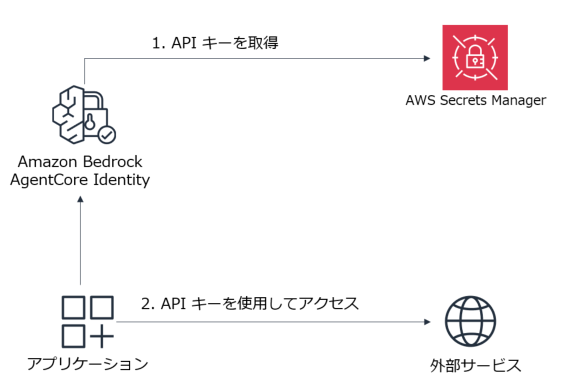
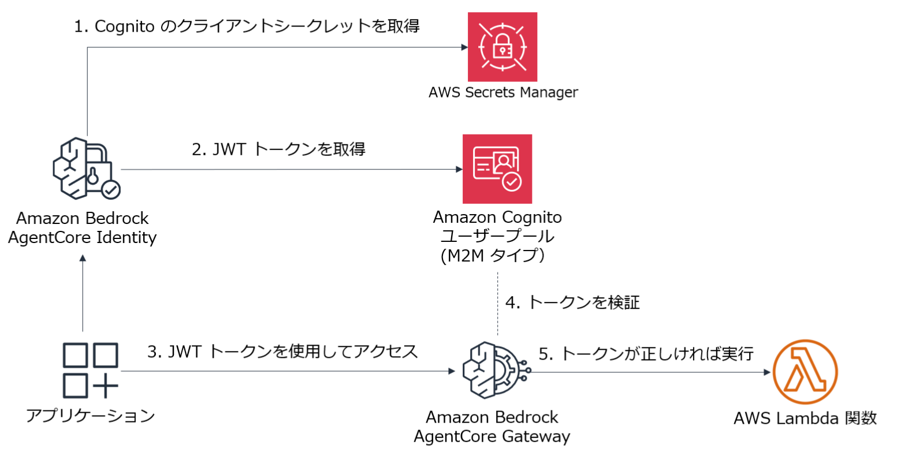

# AgentCore Identity (Outbound Auth)

## AgentCore Identity のユースケース

1. Inbound Auth
    1. AgentCore Runtime で動作する Agent の呼び出しに Bearer トークンが必要という構成にする
    2. AgentCore Gateway と統合したツールの呼び出し時に Bearer トークンが必要という構成にする

2. Outbound Auth
    1. AgentCore Identity を使用し Agent が外部サービスを呼び出すときと API キーを取得する
    2. AgentCore Identity を使用し Agent が外部サービスを呼び出すときと JWT トークンを取得する

---
## Outbound Auth


### 1. AgentCore Identity を使用し Agent が外部サービスを呼び出すときと API キーを取得する



#### タスク 1
* **main-apiKey-OpenWeather.py**
* このサンプルコードでは Agent ではなく通常の Python コードから OpenWeather の API キーを取得し、シアトルの天候情報を取得する

##### 準備

1. OpenWeather の API キーを入手しておく (無料)
    - https://openweathermap.org/

1. AWS マネジメントコンソールで AgentCore Identity の API キーを作成

1. Anthropic の SDK のインストール（uv を使用）

    ```
    uv add requests
    ```

##### 実行

1. サンプル実行

    ```
    uv run main-apiKey-OpenWeatgher.py
    ```

#### タスク 2 (実施は不要です) 
* **main-apiKey.py**
* このサンプルコードでは Agent ではなく通常の Python コードから API キーを取得し、Anthropic SDK を使用して Claude を呼び出す

##### 準備

1. Anthropic の API キーを入手しておく (有料)

1. AWS マネジメントコンソールで AgentCore Identity の API キーを作成

1. Anthropic の SDK のインストール（uv を使用）

    ```
    uv add anthropic
    ```

##### 実行

1. サンプル実行

    ```
    uv run main-apiKey.py
    ```

---

### 2. AgentCore Identity を使用し Agent が外部サービスを呼び出すときと JWT トークンを取得する




---

#### [推奨の手順はこちら](https://github.com/tetsuo-nobe/BedrockAgentCoreBasic/tree/main/gateway#agentcore-identity-outbound-%E8%AA%8D%E8%A8%BC%E3%81%AE%E6%A9%9F%E8%83%BD%E3%81%A7-oauth-%E3%82%AF%E3%83%A9%E3%82%A4%E3%82%A2%E3%83%B3%E3%83%88-%E3%82%AF%E3%83%AC%E3%83%87%E3%83%B3%E3%82%B7%E3%83%A3%E3%83%AB%E3%83%97%E3%83%AD%E3%83%90%E3%82%A4%E3%83%80%E3%82%92%E4%BD%BF%E7%94%A8%E3%81%97%E3%81%A6-gateway-%E3%81%B8%E3%82%A2%E3%82%AF%E3%82%BB%E3%82%B9%E3%81%99%E3%82%8B)

* 上記は AgentCore Gateway を作成、アクセスする一連のワーク手順で、その中で Identity Outbound 認証の OAuth クライアント（クレデンシャルプロバイダ）も使用する手順も含まれている。


---
#### その他のサンプル
* **main.py**
    - Outbound 認証で Gateway にアクセスするエージェントを Runtime にデプロイする場合の実装
    - agentcore コマンドでデプロイできる  
* **create-api-key.py**
    - コードから AgentCore Identity で管理するキーを作成するサンプル
* **test-anthropic.py**
    - スタンドアローンで Anthropic の API キーを使用するサンプル
---


