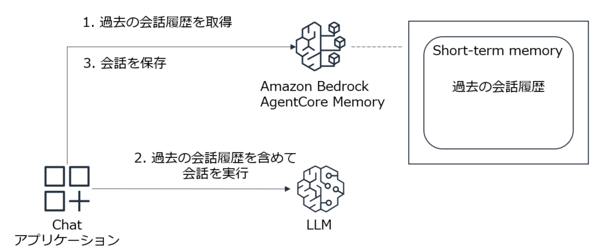

# AgentCore Memory の Short-term memory を Strands Agent から使用する

* Strands Agents　ではデフォルトで SlidingWindowConversationManager で直近の会話履歴のみ保持している
    - 他の ConversationManager の使用も可能
* **このサンプルでは、AgentCore Memory の Short-term memory を会話履歴の保存用に使用する**



---
* 準備 .env ファイルを作成し、`MEMORY_ID=placeholder` を記述しておく

```
python create_memory.py
```

```
python chat.py
```
